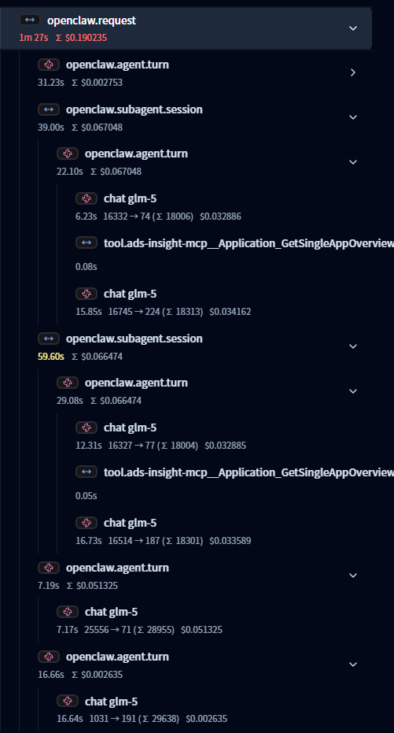

# Traces Reference

The plugin generates connected distributed traces using OpenClaw's hook-based plugin API and diagnostic events.

## Trace Structure

Every user message produces a trace tree. When an agent delegates work to subagents, nested session spans appear as children of the parent root span.

### Simple Request Flow

```
openclaw.request (SERVER span — full message lifecycle)
├── openclaw.agent.turn (INTERNAL — agent processing)
│   ├── gen_ai.system_instructions.chars: 1250
│   ├── gen_ai.input.messages.chars: 45210
│   ├── gen_ai.input.messages.size: 12
│   ├── gen_ai.output.messages.size: 5
│   ├── gen_ai.output.messages.chars: 8920
│   ├── gen_ai.agent.used_skills: coding,web_search
│   ├── chat claude-opus-4-5 (CLIENT span — LLM call)
│   │   └── traceloop.entity.input/output (if captureContent enabled)
│   ├── tool.exec (INTERNAL — tool execution)
│   ├── tool.Read (INTERNAL — file read)
│   └── tool.Write (INTERNAL — file write)
└── openclaw.command.new (INTERNAL — if session reset)
```

### Subagent Request Flow

When an agent spawns subagents, each subagent gets its own `openclaw.subagent.session` span nested under the parent's root span:

```
openclaw.request (root span — parent session)
├── openclaw.agent.turn (parent agent processing)
│   ├── chat claude-opus-4-5 (LLM call)
│   └── tool.exec (tool call that triggers subagent spawn)
├── openclaw.subagent.session (child #1 — subagent lifecycle)
│   ├── openclaw.agent.turn (subagent's agent processing)
│   │   ├── chat claude-sonnet-4 (LLM call)
│   │   └── tool.Read
│   └── openclaw.subagent.outcome: ok
├── openclaw.subagent.session (child #2 — subagent lifecycle)
│   ├── openclaw.agent.turn (subagent's agent processing)
│   │   ├── chat claude-sonnet-4
│   │   └── tool.Write
│   └── openclaw.subagent.outcome: ok
└── (parent root span ends when all subagents complete)
```



All spans within a request share the same `traceId` and are linked via parent-child relationships.

## Request Span

Created by the `message.queued` diagnostic event. This is the root span for the entire request lifecycle.

| Field | Value |
|-------|-------|
| **Span Name** | `openclaw.request` |
| **Kind** | `SERVER` |

**Attributes:**

| Attribute | Type | Description |
|-----------|------|-------------|
| `openclaw.message.channel` | string | Source channel (`whatsapp`, `telegram`, `discord`, etc.) |
| `openclaw.session.key` | string | Session identifier |
| `gen_ai.conversation.id` | string | Conversation ID (same as session key) |
| `openclaw.message.direction` | string | Always `"inbound"` |
| `openclaw.message.source` | string | Message source |
| `openclaw.request.duration_ms` | int | Total request duration |
| `traceloop.entity.input` | string | User message (if `captureContent` enabled) |
| `traceloop.entity.output` | string | Agent response (if `captureContent` enabled) |

**Status:** `OK` on success, `ERROR` with message on failure.

## Agent Turn Span

Created by `llm_input`, ended by `llm_output`. Child of the request span (or subagent session span for subagents).

| Field | Value |
|-------|-------|
| **Span Name** | `openclaw.agent.turn` |
| **Kind** | `INTERNAL` |

**Attributes:**

| Attribute | Type | Description |
|-----------|------|-------------|
| `gen_ai.agent.id` | string | Agent identifier |
| `openclaw.session.key` | string | Session identifier |
| `gen_ai.conversation.id` | string | Session/conversation identifier |
| `gen_ai.system` | string | LLM provider (anthropic, openai, etc.) |
| `gen_ai.request.model` | string | Model requested |
| `gen_ai.system_instructions.chars` | int | Character count of the system prompt |
| `gen_ai.input.messages.chars` | int | Total characters in input messages |
| `gen_ai.input.messages.size` | int | Number of input messages |
| `gen_ai.output.messages.size` | int | Number of output messages (set at `agent_end`) |
| `gen_ai.output.messages.chars` | int | Total characters in output messages (set at `agent_end`) |
| `openclaw.agent.duration_ms` | int | Turn duration in milliseconds |
| `gen_ai.agent.used_skills` | string | Comma-separated list of skills used by the agent (if any skills were used) |
| `openclaw.agent.error` | string | Error message (on failure, truncated to 500 chars) |
| `traceloop.entity.input` | string | Serialized message list (if `captureContent` enabled) |
| `traceloop.entity.output` | string | Agent response (if `captureContent` enabled) |

!!! note
    Token counts (`gen_ai.usage.*`) are available on the individual LLM Chat Spans below, not on the agent turn span.

!!! note "Security Detection"
    If a security event is detected (prompt injection in user message), the span status will be set to `ERROR` with the security alert details.

## LLM Chat Spans

Created retrospectively from assistant messages during `agent_end`. Child of the agent turn span.

| Field | Value |
|-------|-------|
| **Span Name** | `chat <model>` (e.g., `chat claude-opus-4-5`) |
| **Kind** | `CLIENT` |

**Attributes:**

| Attribute | Type | Description |
|-----------|------|-------------|
| `gen_ai.operation.name` | string | Always `"chat"` |
| `gen_ai.provider.name` | string | LLM provider |
| `gen_ai.system` | string | Same as provider |
| `gen_ai.request.model` | string | Model requested |
| `gen_ai.response.model` | string | Model used |
| `gen_ai.usage.input_tokens` | int | Input tokens for this call |
| `gen_ai.usage.output_tokens` | int | Output tokens for this call |
| `gen_ai.usage.total_tokens` | int | Total tokens for this call |
| `gen_ai.usage.cache_read_tokens` | int | Cache read tokens |
| `gen_ai.usage.cache_write_tokens` | int | Cache write tokens |
| `gen_ai.response.stop_reason` | string | Stop reason (if not `end_turn`) |
| `traceloop.entity.input` | string | Prompt content (if `captureContent` enabled) |
| `traceloop.entity.output` | string | Response content (if `captureContent` enabled) |

**Status:** `OK` on success (stop_reason is `stop` or `end_turn`), otherwise includes stop_reason as attribute.

## Tool Execution Spans

Created by `before_tool_call` and ended by `tool_result_persist`. Child of the agent turn span.

| Field | Value |
|-------|-------|
| **Span Name** | `tool.<tool_name>` |
| **Kind** | `INTERNAL` |

**Examples:** `tool.exec`, `tool.web_fetch`, `tool.browser`, `tool.Read`, `tool.Write`, `tool.Edit`, `tool.memory_search`

**Attributes:**

| Attribute | Type | Description |
|-----------|------|-------------|
| `gen_ai.operation.name` | string | Always `"execute_tool"` |
| `gen_ai.tool.name` | string | Tool name |
| `gen_ai.tool.call.id` | string | Unique tool call identifier |
| `openclaw.tool.call_id` | string | Same as gen_ai.tool.call.id |
| `openclaw.tool.is_synthetic` | boolean | Whether the tool call is synthetic |
| `openclaw.tool.result_chars` | int | Total characters in result |
| `openclaw.tool.result_parts` | int | Number of content parts in result |
| `openclaw.tool.duration_ms` | int | Tool execution duration |
| `traceloop.entity.input` | string | Tool input (if `captureContent` enabled) |
| `traceloop.entity.output` | string | Tool output (if `captureContent` enabled) |

**Status:** `OK` on success, `ERROR` if the tool returned an error or security event was detected.

!!! warning "Security Detection"
    Tool spans are checked for security events:
    - **Sensitive file access** for `Read`, `Write`, `Edit` tools
    - **Dangerous commands** for `exec` tool
    
    If detected, span status becomes `ERROR` with security alert details.

## Subagent Session Span

Created by `subagent_spawned`, ended by `subagent_ended`. Child of the parent session's root span. This span represents the full lifecycle of a subagent session, including all its agent turns, LLM calls, and tool executions.

| Field | Value |
|-------|-------|
| **Span Name** | `openclaw.subagent.session` |
| **Kind** | `INTERNAL` |

**Attributes (set at spawn):**

| Attribute | Type | Description |
|-----------|------|-------------|
| `openclaw.session.key` | string | Child session identifier |
| `gen_ai.conversation.id` | string | Run ID of the subagent task |
| `openclaw.message.channel` | string | Channel that initiated the request |
| `openclaw.subagent.label` | string | Human-readable label for the subagent |
| `openclaw.subagent.agent_id` | string | Agent identifier for the subagent |
| `openclaw.subagent.mode` | string | Execution mode (e.g., `sync`, `async`) |
| `openclaw.subagent.parent_session_key` | string | Parent session key |

**Attributes (set at end):**

| Attribute | Type | Description |
|-----------|------|-------------|
| `openclaw.request.duration_ms` | int | Total subagent session duration |
| `openclaw.subagent.outcome` | string | Outcome of the subagent (`ok`, `error`, etc.) |
| `openclaw.subagent.reason` | string | Reason for the subagent ending |
| `openclaw.request.error` | string | Error description (only set on failure) |
| `traceloop.entity.input` | string | Subagent input message (if `captureContent` enabled) |

**Status:** `OK` when outcome is `"ok"`, `ERROR` with details otherwise.

!!! note "Parent Span Lifecycle"
    When all subagent children of a parent session have ended and the parent's agent span has also ended, the parent's root span (`openclaw.request`) is automatically closed and cleaned up.

!!! note "Nesting"
    Subagents can themselves spawn further subagents, creating arbitrarily deep nesting. Each level follows the same `openclaw.subagent.session` → `openclaw.agent.turn` → child spans pattern.

## Command Spans

Created when session commands are issued.

| Span Name | Kind | Description |
|-----------|------|-------------|
| `openclaw.command.new` | INTERNAL | `/new` command |
| `openclaw.command.reset` | INTERNAL | `/reset` command |
| `openclaw.command.stop` | INTERNAL | `/stop` command |

**Attributes:**

| Attribute | Type | Description |
|-----------|------|-------------|
| `openclaw.command.action` | string | Command name |
| `openclaw.command.session_key` | string | Session identifier |
| `openclaw.command.source` | string | Command source |

## Gateway Spans

| Span Name | Kind | Description |
|-----------|------|-------------|
| `openclaw.gateway.startup` | INTERNAL | Gateway startup event |

## Webhook Spans

Created by diagnostic events for webhook processing.

| Span Name | Kind | Description |
|-----------|------|-------------|
| `openclaw.webhook.processed` | INTERNAL | Successful webhook processing |
| `openclaw.webhook.error` | INTERNAL | Webhook processing error |

**Attributes:**

| Attribute | Type | Description |
|-----------|------|-------------|
| `openclaw.channel` | string | Source channel |
| `openclaw.webhook` | string | Update type |
| `openclaw.chatId` | string | Chat ID (if available) |
| `openclaw.error` | string | Error message (error span only) |

## Session Stuck Spans

Created when a session is detected as stuck.

| Span Name | Kind | Description |
|-----------|------|-------------|
| `openclaw.session.stuck` | INTERNAL | Session stuck in processing |

**Attributes:**

| Attribute | Type | Description |
|-----------|------|-------------|
| `openclaw.state` | string | Session state |
| `openclaw.sessionKey` | string | Session key |
| `openclaw.sessionId` | string | Session ID |
| `openclaw.queueDepth` | int | Current queue depth |
| `openclaw.ageMs` | int | Age of stuck session |

**Status:** Always `ERROR` with message "session stuck".

## Trace Context Propagation

The plugin maintains a `sessionContextMap` keyed by `sessionKey`:

### Simple Request Flow

1. `message.queued` (diagnostic event) creates a root span and stores its context
2. `llm_input` creates an agent turn span as a child of the root
3. `before_tool_call` records pending tool span data (keyed by `toolCallId`)
4. `llm_output` ends the agent turn span
5. `agent_end` creates LLM spans and tool spans from messages, sets final attributes
6. `message.processed` (diagnostic event) ends the root span, cleans up the context

### Subagent Request Flow

1. `subagent_spawned` creates `openclaw.subagent.session` as a child of the parent's root context
2. The subagent session is stored in `sessionContextMap` under `childSessionKey`
3. Subsequent `llm_input` / `llm_output` hooks create `openclaw.agent.turn` spans under the subagent session
4. `subagent_ended` ends the subagent root span and cleans up
5. If the parent's agent span has ended and all children have ended, the parent's root span is also closed

### Stale Context Cleanup

Stale contexts (no completion within 30 minutes) are automatically cleaned up by a periodic cleanup interval running every 60 seconds.

## Hook Events vs Diagnostic Events

The plugin uses two complementary event systems:

### Hook Events (via `api.on()`)

| Hook | Description |
|------|-------------|
| `before_agent_start` | Compatibility hook (agent span creation moved to `llm_input`) |
| `llm_input` | Creates agent turn span, resolves user input from `message_received` |
| `llm_output` | Ends agent turn span, captures output content |
| `agent_end` | Creates LLM/tool spans from messages, sets final agent attributes |
| `before_tool_call` | Records pending tool span data (keyed by `toolCallId`) |
| `tool_result_persist` | Updates pending tool span with end time and output |
| `message_received` | Stores user message input for later resolution |
| `before_prompt_build` | Injects skill tracking instructions into system prompt |
| `session_start` | Logs session start event |
| `session_end` | Logs session end event |
| `subagent_spawned` | Creates `openclaw.subagent.session` span as child of parent |
| `subagent_ended` | Ends subagent session span, triggers parent cleanup if needed |

### Diagnostic Events (via `onDiagnosticEvent`)

| Event | Description |
|-------|-------------|
| `message.queued` | Creates root request span |
| `message.processed` | Ends root request span |
| `model.usage` | Records token and cost metrics |
| `webhook.received` | Records webhook received counter |
| `webhook.processed` | Creates webhook processed span |
| `webhook.error` | Creates webhook error span |
| `queue.lane.enqueue` | Records queue enqueue counter |
| `queue.lane.dequeue` | Records queue dequeue counter |
| `session.state` | Records session state counter |
| `session.stuck` | Creates session stuck span |
| `run.attempt` | Records run attempt counter |
| `diagnostic.heartbeat` | Records heartbeat queue depth |

## Example DQL Queries (Dynatrace)

**Token usage per LLM call:**

```sql
fetch spans, samplingRatio:1
| filter startsWith(span.name, "chat ")
| fields start_time, duration, 
         gen_ai.usage.input_tokens,
         gen_ai.usage.output_tokens, 
         gen_ai.usage.cache_read_tokens,
         gen_ai.usage.cache_write_tokens,
         gen_ai.usage.total_tokens,
         gen_ai.response.model
| sort start_time desc
| limit 20
```

**Tool execution breakdown:**

```sql
fetch spans, samplingRatio:1
| filter startsWith(span.name, "tool.")
| fields start_time, span.name, duration, openclaw.tool.result_chars
| sort start_time desc
| limit 50
```

**Full trace for a session:**

```sql
fetch spans, samplingRatio:1
| filter openclaw.session.key == "agent:main:main"
| fields start_time, span.name, duration, span.kind, trace.id
| sort start_time desc
```

**Subagent sessions with outcomes:**

```sql
fetch spans, samplingRatio:1
| filter span.name == "openclaw.subagent.session"
| fields start_time, duration, 
         openclaw.subagent.label,
         openclaw.subagent.outcome,
         openclaw.subagent.reason,
         openclaw.subagent.parent_session_key
| sort start_time desc
| limit 50
```

**Security events in traces:**

```sql
fetch spans, samplingRatio:1
| filter security.event.detected == true
| fields start_time, span.name, security.event.detection, 
         security.event.severity, security.event.description
| sort start_time desc
```

## Semantic Conventions

The plugin follows [OpenTelemetry GenAI Semantic Conventions](https://opentelemetry.io/docs/specs/semconv/gen-ai/) for:

- `gen_ai.usage.*` - Token usage attributes
- `gen_ai.system` / `gen_ai.provider.name` - Provider identification
- `gen_ai.request.model` / `gen_ai.response.model` - Model identification
- `gen_ai.operation.name` - Operation type (chat, execute_tool)
- `gen_ai.tool.*` - Tool-related attributes
- `gen_ai.conversation.id` - Conversation/session tracking

Custom OpenClaw attributes use the `openclaw.*` namespace.

## Content Capture

When `captureContent: true` is configured, spans include:

- `traceloop.entity.input` - Input content (prompts, tool arguments)
- `traceloop.entity.output` - Output content (responses, tool results)

!!! warning "Privacy Consideration"
    Enabling content capture will send user messages and AI responses to your observability backend. Consider privacy implications before enabling in production.